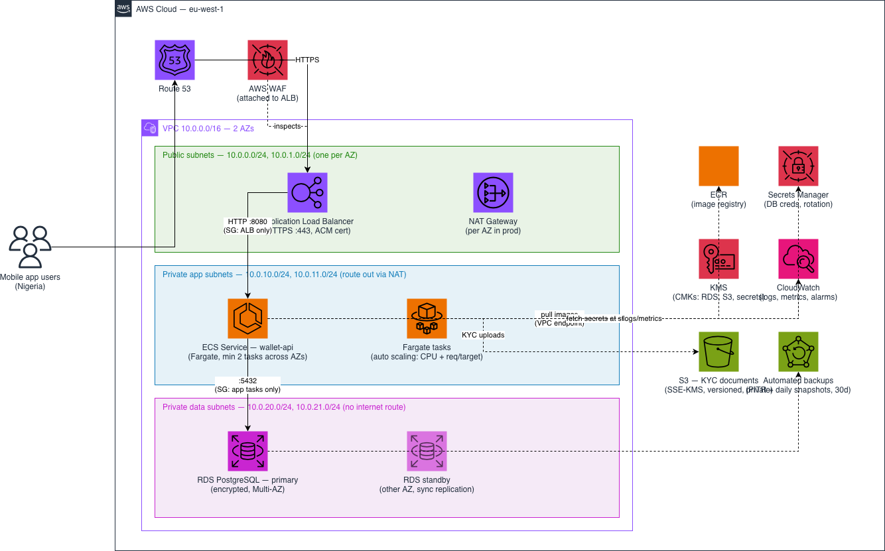

# Dexter Wallet — Infrastructure Challenge

Submission for the Cloud & Infrastructure Engineer technical challenge: AWS architecture for a digital wallet backend, a Terraform slice of it, and a containerized API with CI.

## Repo layout

```
docs/
  architecture.drawio        architecture diagram (PNG export alongside)
  DESIGN.md                  full design write-up and trade-offs
  email-deliverability.md    optional stretch: SPF/DKIM/DMARC + PowerMTA warming plan
terraform/                   VPC + ECS Fargate service + RDS PostgreSQL
app/                         minimal Node API + Dockerfile
docker-compose.yml           runs the API locally
.github/workflows/ci.yml     tests, image build + smoke test, terraform checks
```

## Architecture



## Design in one paragraph

A single VPC across two AZs with three subnet tiers: public (ALB + NAT only), private app (ECS Fargate tasks), and private data (RDS, no internet route at all). Traffic flows internet → ALB (WAF, TLS) → Fargate tasks → PostgreSQL, with each hop locked to the previous one's security group rather than CIDR ranges. Fargate over EKS/EC2 because a small team shouldn't spend its time on cluster or host management; RDS PostgreSQL Multi-AZ because wallet ledgers need ACID and automated failover. Full reasoning, including the region choice and cost notes, is in [docs/DESIGN.md](docs/DESIGN.md).

## Security and secrets

- No secrets exist in code, tfstate, task definitions, or CI. RDS generates its own master password directly into Secrets Manager (`manage_master_user_password`) and ECS injects it into the container at start by ARN reference.
- IAM follows the ECS two-role split: the execution role can pull the image, write logs, and read exactly one secret; the task role holds only what application code itself needs (currently nothing).
- Encryption at rest via a customer-managed KMS key (RDS) and in transit end to end (`rds.force_ssl` on Postgres, TLS at the ALB).
- The database subnets have no route to the internet; the DB security group accepts only the app tier on 5432 and has no egress rules.
- Containers run as a non-root user; ECR scans images on push.

## Running it

```bash
# API locally
docker compose up --build
curl localhost:8080/healthz

# Terraform checks (no AWS account needed)
cd terraform
terraform init -backend=false
terraform fmt -check && terraform validate
```

CI runs all of the above on every push: unit tests, image build with a health-endpoint smoke test, and `terraform fmt`/`validate`.

## What I'd add to make this production-ready

Remote Terraform state (S3 + DynamoDB locking) with per-environment configs; an HTTPS listener with ACM once a domain exists, and WAF managed rules on the ALB; a CD pipeline that pushes to ECR and cuts new task definition revisions with the circuit breaker guarding rollback; cross-region backup copies for RDS via AWS Backup; GuardDuty, Security Hub, CloudTrail and VPC Flow Logs organization-wide; SSM Session Manager as the only human access path; and CloudWatch alarms wired to a real on-call channel.

## What I'd improve with more time

Extract the Terraform into reusable modules once a second environment exists (premature before that); add tflint/checkov to CI; load-test to size the Fargate tasks and RDS instance on data instead of defaults; and build out structured audit logging for money movement before any real transaction flows.

## Tooling note

I used Claude as an AI pair-assistant for research and drafting throughout this challenge. All design decisions, code review, validation and local testing are mine, and I'm happy to defend any choice here in person.
